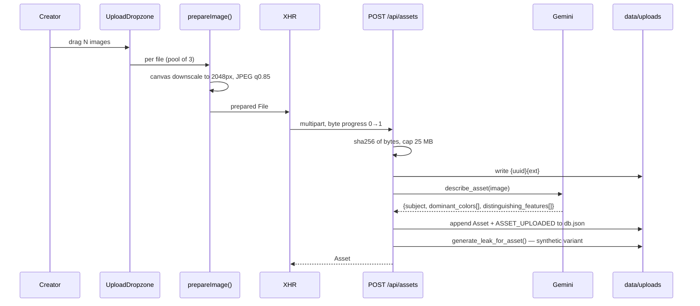
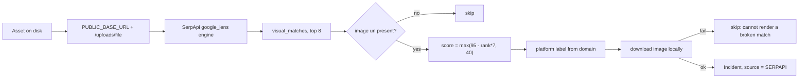
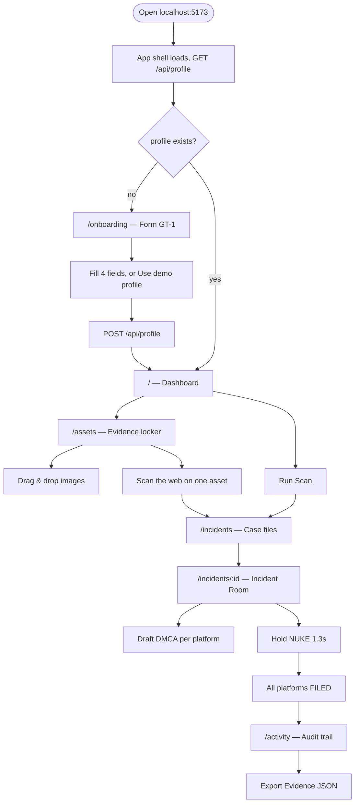
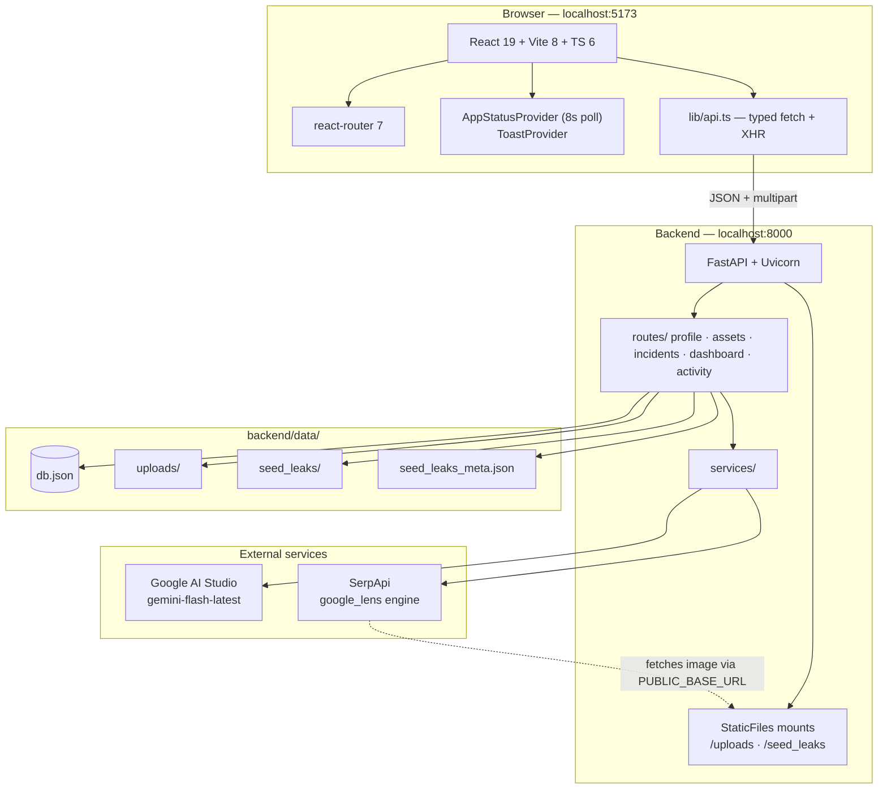
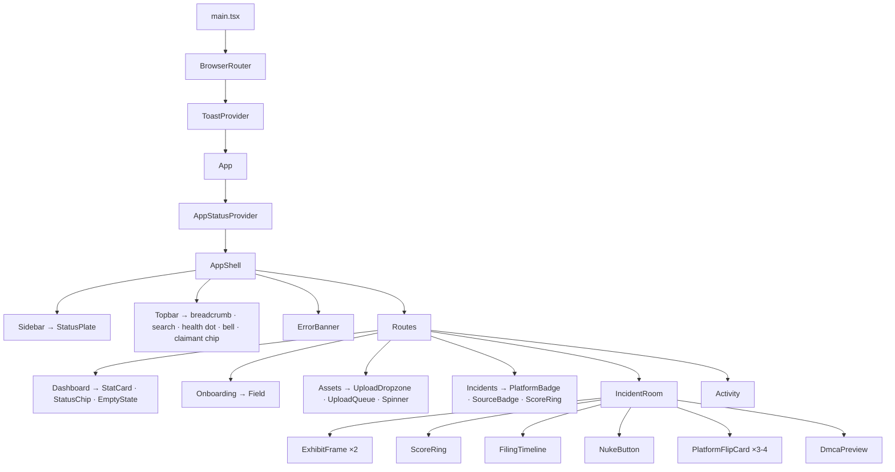
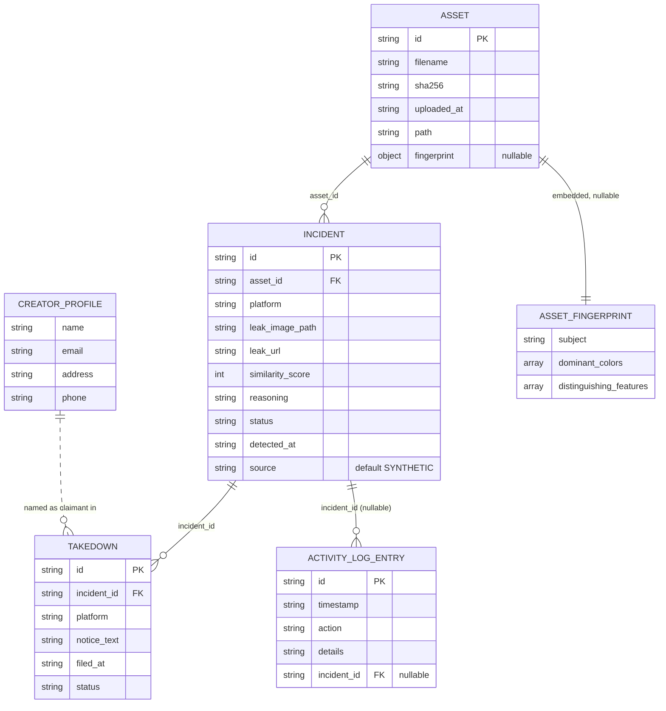
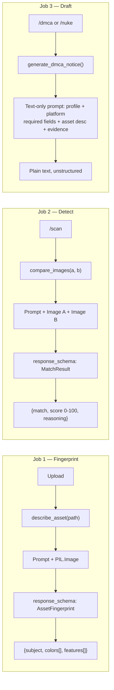
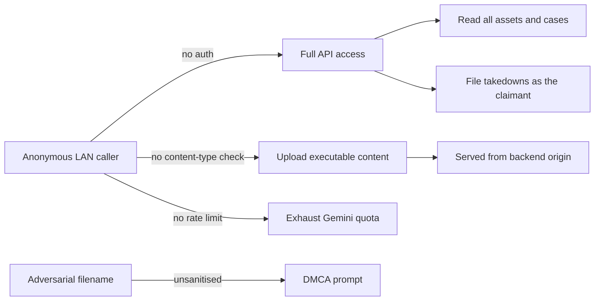

# 👻 GhostTrace

**Automated leak detection and DMCA takedown filing for content creators.**

> Every creator has had their work stolen. GhostTrace fingerprints your content, uses Gemini vision to identify leaked or re-uploaded copies, and files a complete DMCA takedown across every platform with one hold of a button. Three hours of legal admin, compressed into thirty seconds.

`Gen AI Hackathon` · `Track 3 — Life Admin: Legal & Compliance Assistance` · `3-hour build window`

---

## Contents

1. [Overview](#1-overview)
2. [Demo](#2-demo)
3. [Features](#3-features)
4. [User journey](#4-user-journey)
5. [Technical architecture](#5-technical-architecture)
6. [Data model](#6-data-model)
7. [API reference](#7-api-reference)
8. [AI pipeline](#8-ai-pipeline)
9. [Design system](#9-design-system)
10. [Development](#10-development)
11. [Performance](#11-performance)
12. [Security](#12-security)
13. [Accessibility](#13-accessibility)
14. [Hackathon submission](#14-hackathon-submission)
15. [Roadmap](#15-roadmap)
16. [Questions for the team](#16-questions-for-the-team)

---

# 1. Overview

## The problem

A creator discovers their work re-uploaded on someone else's channel. What follows is not creative work — it is clerical work, and it is brutal:

| Step | Reality today |
|---|---|
| Find the copy | Manual reverse-image search, one image at a time |
| Prove it's yours | Screenshot, note the URL, find your original file |
| Find the right form | Every platform has a different DMCA process |
| Fill it in | Legal-register prose, sworn statements, per-platform required fields |
| Repeat | Once per platform, per incident |
| Keep records | Nobody does, until they need to |

That is hours of unpaid administrative labour per incident — the exact shape of the problem Track 3 describes as *Life Admin*.

## The solution

GhostTrace turns that workflow into a four-step loop:

```
Upload  →  Scan  →  Review the evidence  →  Hold NUKE
```

- **Upload** catalogues your work with a SHA-256 hash and a Gemini-generated semantic fingerprint.
- **Scan** compares your work against candidate copies using Gemini's multimodal vision, and against the live public web using Google Lens reverse-image search.
- **Review** puts the original and the suspect copy side by side with a similarity score and the model's one-sentence reasoning.
- **NUKE** drafts a legally-shaped, platform-correct DMCA notice for every platform at once, files them, and appends every step to an exportable audit trail.

## Core value proposition

> **The evidence, the paperwork, and the audit trail — produced in one gesture.**

Not "an AI that finds your stolen content." An AI that does the *legal admin* that follows.

## What is real, and what is simulated

We are explicit about this everywhere — in the product UI, in the code comments, and here. Judges asking "is the AI real?" should get the same answer from every surface.

| Capability | Status | Detail |
|---|---|---|
| Semantic fingerprinting on upload | ✅ **Real** | Live Gemini vision call per asset |
| Visual match scoring + reasoning | ✅ **Real** | Live Gemini vision call comparing two images |
| DMCA notice drafting | ✅ **Real** | Live Gemini text generation, per platform, per incident |
| Reverse-image search of the public web | ✅ **Real** | SerpApi `google_lens` engine — live results already in the demo DB from `commons.wikimedia.org`, `www.reddit.com`, `en.wikipedia.org` |
| Leak *discovery* in the default `/scan` path | ⚠️ **Simulated** | Compares your assets against pre-seeded synthetic "leak" variants. The vision matching is real; only the discovery is staged |
| DMCA *submission* | ⚠️ **Simulated** | Real notice text is generated and timestamped; nothing is transmitted to a platform |
| Authentication | ❌ **Not built** | Single implicit user, by design |
| Database | ❌ **Not built** | A single JSON file, by design |

The Assets page carries this note in-product, verbatim:

> ⓘ **HOW SCANNING WORKS** — We never crawl the internet. One image is sent to Google's reverse-image index; it returns every indexed page using it. Private accounts and closed groups are invisible to everyone — we say so instead of pretending.

---

# 2. Demo

> 🎬 **Assets to embed here** — see the *Assets to generate* section of the handoff doc. This section currently has no recorded media.

**Demo click-path (rehearsed, ~90 seconds):**

1. **Dashboard** — stat row, "last sweep" timestamp, latest detections ledger.
2. **Assets** — drag in an image. Watch the upload queue move through *preparing → uploading → analyzing*, then the card renders with its SHA-256 and Gemini's colour chips.
3. **Scan the web** on that asset — a UV scanline sweeps the tile while Google Lens is queried. Real matches open as cases.
4. **Run Scan** from the Dashboard — toast: *"Scan complete — N new cases opened."*
5. **Open a case** → Incident Room. Original vs. suspect side by side, animated score ring, Gemini's reasoning in the evidence panel.
6. **Tab through DMCA previews** — YouTube / X / Instagram, each drafted live, each carrying that platform's required fields.
7. **Hold NUKE** — the arming ring fills over 1.3 seconds, the disc shakes, and the platform cards flip one after another to FILED.
8. **Activity** → **Export Evidence JSON** — the complete, timestamped audit trail as a file.

---

# 3. Features

## 3.1 Evidence intake (asset upload)

**Purpose** — Get a creator's work catalogued with something a lawyer would recognise as provenance, in as few interactions as possible.

**How it works**



**Technical implementation**

- Client-side downscale before the wire: longest edge capped at **2048px**, JPEG quality **0.85**. Files under **1.5 MB** that don't need resizing pass through untouched. Anything the canvas can't handle (SVG, exotic codecs) falls back to the original file rather than failing.
- Upload concurrency is **3** — above ~4 the browser queues them anyway.
- `fetch()` cannot report request-body progress, so uploads drop to **XMLHttpRequest**. This is the only reason that API is still in the codebase.
- When byte progress hits 1.0 the UI flips to an **indeterminate "analyzing" stage** rather than sitting at 100% — the server is still running the Gemini fingerprint.
- Server-side cap: **25 MB**, returning `413` with a human-readable size in the detail.
- Every upload also synthesises one distorted "leak" variant of itself, so a subsequent `/scan` has something of the *user's own* content to find.

**Files** — `frontend/src/lib/upload.ts` · `frontend/src/components/UploadDropzone.tsx` · `frontend/src/components/UploadQueue.tsx` · `frontend/src/pages/Assets.tsx` · `backend/app/routes/assets.py` · `backend/app/seed.py`

**Edge cases handled**

| Case | Behaviour |
|---|---|
| Non-image dropped | Filtered client-side, one aggregated error toast |
| File > 25 MB | Downscaled in-browser first; the server cap is a backstop against curl |
| Canvas produces a *larger* file | Original is kept |
| Drag across child elements | Depth counter, not a boolean — no border flicker |
| Upload fails mid-batch | Per-item retry; the original `File` is held in a ref keyed by item id |
| Gemini unreachable | Canned fingerprint, logged as `FALLBACK`, upload still succeeds |

**Limitations** — No duplicate detection by SHA-256 (the same file uploaded twice creates two assets). No EXIF extraction. No video, audio, or PDF.

---

## 3.2 Synthetic scan (`/api/scan`)

**Purpose** — Demonstrate the detection-to-case pipeline end to end without depending on the public web being cooperative during a live demo.

**How it works** — For every registered seed leak that isn't already attached to an incident, compare it against *every* asset via Gemini and keep the **highest-scoring** match. Score ≥ **60** opens an `Incident` with `source = "SYNTHETIC"`.

> ⚠️ Best-match, not first-match. With several template-like demo assets more than one can clear 60, and the case must be attributed to the truest match.

**Files** — `backend/app/routes/incidents.py` (`run_scan`) · `backend/app/services/gemini_vision.py`

**Limitations**

- The sweep is **O(unmatched leaks × assets)** live Gemini calls with no batching, caching, or early exit. The demo database currently holds **310 assets** and **8 registered seed leaks** — a fresh sweep against all of them would be ~2,480 vision calls. In practice most leaks are already incidented, so the loop skips them, but this does not scale and is the single biggest architectural debt in the backend.
- No cost or latency ceiling on the endpoint.

---

## 3.3 Real reverse-image search (`/api/assets/{id}/web-scan`)

**Purpose** — The honest answer to "does this actually find things on the internet?" It does.

**How it works**



**Technical implementation**

- Engine: **SerpApi `google_lens`**. Google Lens fetches the image *itself*, so it needs a **public URL, not bytes** — hence the `PUBLIC_BASE_URL` requirement.
- Lens returns no native similarity score, so one is **approximated from result rank**: `max(95 - i*7, 40)` across the top 8. This is a rank proxy, and the documentation says so rather than dressing it up as a confidence value.
- Platform is inferred from the result domain via a hint table (`youtube.com`, `youtu.be`, `ytimg.com` → YouTube; `x.com`, `twitter.com`, `twimg.com` → X; `instagram.com`, `cdninstagram.com` → Instagram). Anything else keeps its bare hostname.
- Each match is **downloaded locally** so the existing `` rendering works unchanged. Many sites block hotlinking, so failures are skipped — which is why the response also carries `raw_match_count`, letting the UI say *"Google found 5 candidates but none were downloadable."*
- Uses **stdlib `urllib`**, deliberately, rather than adding an HTTP client dependency for a single REST call. 20s search timeout, 10s download timeout.
- **Never raises.** No key, unreachable tunnel, API error, zero results — all return `[]`.

**Proof it works** — the live demo database contains 7 SerpApi-sourced incidents:

| Platform | Score | Status |
|---|---|---|
| commons.wikimedia.org | 95 | Detected |
| www.reddit.com | 88 | Detected |
| simple.wiktionary.org | 81 | Detected |
| commons.wikimedia.org | 74 | Detected |
| gnu-octave.github.io | 67 | Detected |
| en.wikipedia.org | 60 | Detected |
| commons.wikimedia.org | 46 | Detected |

**Files** — `backend/app/services/serpapi_web_detection.py` · `backend/app/routes/incidents.py` (`run_web_scan`)

**Limitations**

- Requires a **public tunnel**. `ngrok http 8000` free URLs rotate on every restart, so `PUBLIC_BASE_URL` must be refreshed before every demo. **This is the single most likely cause of a failed live demo.**
- Lens only finds **already-indexed** images. The Pillow-generated seed assets will always return zero matches — demo with a genuinely published image.
- Score is a rank proxy, not a similarity measurement.
- Matches below the `/scan` threshold of 60 are still opened as cases here (the 46-score row above) — `web-scan` applies no threshold.

**Why not Google Cloud Vision** — an earlier implementation (`vision_web_detection.py`, removed in `99bc83c`) used Cloud Vision `WEB_DETECTION`, which accepts inline base64 and needs no tunnel. It was dropped because Cloud Vision **requires a billing account with a card even for its 1,000 free units/month** ($3.50/1k after). If a card is ever acceptable that path is strictly simpler. Note its key would be separate — AI Studio keys 403 against Cloud Vision.

---

## 3.4 The Incident Room

**Purpose** — Make a legal decision defensible in one screen. Everything a claimant needs to be confident before an irreversible action.

**Anatomy**

| Region | What it does |
|---|---|
| Case header | Docket-style case number, source badge (Live detection / Demo data), status chip, the platform, the live leak URL |
| Evidence, side by side | Original on the left, suspect on the right. The suspect frame carries a coral wash **and** a travelling UV scanline so the two panes are never confusable at a glance — which matters when the next click files a legal notice |
| Score ring | Animated arc, colour-thresholded: ≥90 coral, ≥75 amber, else UV blue |
| Reasoning panel | Gemini's one-sentence justification, or the SerpApi provenance line. The heading changes to match the source — it does not credit Gemini for a SerpApi finding |
| Filing timeline | Numbered ledger of steps taken and steps remaining |
| Strike panel | The NUKE button plus one flip card per platform |
| DMCA preview tabs | One tab per platform, drafted on demand, with copy-to-clipboard |

**Dynamic platform set** — the tab strip and flip-card row are `[incident.platform, YouTube, X, Instagram]` deduplicated. A real SerpApi match on `commons.wikimedia.org` therefore produces **four** tabs and four filings, not three.

**Files** — `frontend/src/pages/IncidentRoom.tsx` · `components/ScoreRing.tsx` · `components/DmcaPreview.tsx` · `components/FilingTimeline.tsx` · `components/PlatformFlipCard.tsx` · `components/SourceBadge.tsx`

---

## 3.5 The NUKE button

**Purpose** — One gesture, every platform. Designed to feel consequential, because it is.

**Interaction design**

- **Hold to arm.** Press and hold for **1300 ms** while an SVG ring fills around the disc. Only a *completed* hold calls the handler. Release early — anywhere on the page, including outside the button — and it disarms.
- Visual feedback scales with commitment: the glow radius grows from 20px to 70px and the disc scales down 6% as the hold completes.
- While filing, the disc runs a shake animation and the caption reads `FILING NOTICES…`.
- On success, three staggered success rings expand outward and each platform card flips to its FILED face at 200ms + 260ms intervals — so a nuke reads as *three separate filings*, not one state change.
- Already-filed cases render the disc in a calm UV-on-white treatment reading `DETONATED`, with the flip cards initialised already-flipped so a page reload shows no phantom animation.

**Why the hold** — a DMCA filing is irreversible and carries a sworn statement under penalty of perjury. The gesture is deliberately hard to hit by accident.

> ⚠️ **Known asymmetry:** keyboard users get `Enter`/`Space`, which fires **immediately** with no hold and no confirmation. A hold gesture isn't reachable from the keyboard, but the current fallback removes the safety rather than replacing it. See [Accessibility](#13-accessibility).

**What actually happens server-side**

```
POST /api/incidents/{id}/nuke
  platforms = dedupe([incident.platform, "YouTube", "X", "Instagram"])
  for each platform:
      notice_text = Gemini text-gen (or canned fallback)
      create Takedown{status: "FILED", filed_at: now}
      log DMCA_FILED
  incident.status = "FILED"
  log NUKE_TRIGGERED
```

Three or four **live Gemini text-generation calls** per nuke. Nothing is transmitted to any platform.

**Files** — `frontend/src/components/NukeButton.tsx` · `backend/app/routes/incidents.py` (`nuke_incident`) · `backend/app/services/dmca.py`

---

## 3.6 Audit trail

**Purpose** — Evidence of process. Five action types, timestamped, newest-first, exportable as JSON with one click.

| Action | UI label | Emitted by |
|---|---|---|
| `ASSET_UPLOADED` | Exhibit entered | `POST /api/assets` |
| `SCAN_RUN` | Sweep run | `/scan`, `/web-scan` |
| `INCIDENT_DETECTED` | Case opened | `/scan`, `/web-scan` |
| `DMCA_FILED` | DMCA filed | `/nuke`, once per platform |
| `NUKE_TRIGGERED` | Filed everywhere | `/nuke` |

Rows carrying an `incident_id` are clickable and deep-link into the Incident Room. Entries are grouped under sticky **Today / Yesterday / date** headers and numbered as a descending ledger (`003`, `002`, `001`).

Export produces `ghosttrace-activity-<ISO-timestamp>.json` entirely client-side — a Blob download, no backend round trip.

**Files** — `frontend/src/pages/Activity.tsx` · `backend/app/routes/activity.py` · `backend/app/utils.py`

---

## 3.7 Fail-soft AI

**Purpose** — A network hiccup must never kill a live demo.

Every Gemini and SerpApi call is wrapped in `try/except` with a canned fallback, and **logs which path was taken**:

```
[gemini_vision] describe_asset LIVE ok for 'data/uploads/abc.png'
[gemini_vision] compare_images FALLBACK (reason: ResourceExhausted(...)) (...)
[dmca] generate_dmca_notice LIVE ok for platform='YouTube' incident='...'
[serpapi_web_detection] LIVE ok for '...' -> 5 match(es)
```

| Call | Fallback |
|---|---|
| `describe_asset` | `{subject: "Uploaded creative asset", colors: [blue, white], features: 3 sampled from a fixed list of 5}` |
| `compare_images` | `{match: true, similarity_score: 87, reasoning: "Fallback heuristic: images share matching structure and palette consistent with a re-upload."}` |
| `generate_dmca_notice` | Full canned boilerplate notice, correctly interpolated with the real profile, asset description, incident URL and score |
| `web_detect` | `[]` — treated as "no matches found" |

You can tell a fallback match at a glance in the demo database: `similarity_score` is exactly **87** and the reasoning begins *"Fallback heuristic:"*.

---

# 4. User journey



## Stage by stage

**Landing** — There is no marketing landing page. The app opens directly into the shell: sidebar rail, sticky topbar, content column. While the profile loads, the content area shows `Opening the docket…` with a spinner.

**Sign up** — There is none. No account, no password, no email verification. The onboarding form is a *legal claimant registration*, not an auth step — it collects the four fields a DMCA notice legally requires (name, email, mailing address, phone) and posts them once. A **Use demo profile** button fills all four with a plausible creator identity for demos.

**Authentication** — None. Documented as a deliberate scope decision, not an oversight. See [Security](#12-security).

**Forced redirect** — Any route visited with `profile === null` redirects to `/onboarding` with `replace: true`. The sidebar navigation is hidden entirely until a profile exists, so the first-run experience has exactly one possible action.

**Dashboard** — Masthead (`Surveillance active · last sweep 4m ago`), a four-card stat row, the three most recent detections as a tappable ledger, and the four most recent activity lines.

**Assets** — Dropzone, live upload queue, then a search + sort toolbar and a paginated grid. Search covers filename, SHA-256, and the Gemini fingerprint text (subject, colours, features), debounced at 300ms. Sort: Newest / Oldest / A–Z. Infinite scroll at 24 rows per page with a `Load N more` fallback button. The topbar's global search is not a second index — it hands its term to `/assets?q=…` and this page reads it from the URL.

**Incidents** — Newest-first case list. Each row: leak thumbnail, case number, source badge, status chip, the reasoning as the headline, platform badge, clickable leak URL, detection timestamp, and a score ring. Open cases carry an amber left border.

**Incident Room** — see [3.4](#34-the-incident-room).

**Settings** — There is no settings page. The claimant profile is set once at onboarding and there is currently **no UI to edit it**, though `POST /api/profile` is a full upsert and would accept an update.

**Logout** — Not applicable. No session exists.

## Error states

| State | Treatment |
|---|---|
| Backend unreachable at boot | Non-blocking `ErrorBanner` above the content with a **Retry** button. The rest of the app stays navigable |
| Backend unreachable during use | Sidebar plate flips to `◉ BACKEND OFFLINE` (coral); topbar dot flips to `OFFLINE`. Detected by the 8-second stats poll |
| Incident not found (404) | Dedicated "Case not found" page with a back link — distinguished from a generic error by branching on `ApiError.status` |
| Activity load fails | Inline `ErrorBanner` with retry, scoped to that panel |
| Detections panel fails | Silently renders empty — a secondary panel must not take the overview down |
| Upload fails | Per-item error row in the queue with **Retry** and **Dismiss** |
| DMCA preview fails | Inline message plus **Retry**, scoped to the active tab |
| Non-image files dropped | Aggregated error toast: *"N non-image files skipped."* |
| Unknown route | Redirect to `/` |

## Success states

Toasts appear bottom-centre, in the operator's line of sight, and auto-dismiss after 5 seconds:

- `Welcome, Jordan — you are the claimant of record.`
- `Intake complete — N exhibit(s) processed.`
- `Scan complete — N new cases opened.` / `Scan complete — no new infringements found.`
- `Real web search found N match(es) for "filename".`
- `Google found N candidate(s) but none were downloadable.`
- `Takedown filed on N platforms.`

## Empty states

Every list has a designed empty state with an icon, a title, a subtitle, and — where there's an obvious next step — a primary action. `Nothing on record yet` on the Dashboard offers *Upload your first asset*. `No cases open` offers *Go to overview*. Search-empty on Assets changes its copy to suggest a different query rather than implying you have no assets.

---

# 5. Technical architecture

## System



## Stack

| Layer | Choice | Version | Rationale |
|---|---|---|---|
| Frontend framework | React | 19.2 | — |
| Build tool | Vite | 8.1 | Instant HMR; `@tailwindcss/vite` plugin, no PostCSS config |
| Language | TypeScript | ~6.0 | — |
| Styling | Tailwind CSS | 4.3 | CSS-first `@theme` config, no `tailwind.config.js` |
| Routing | react-router-dom | 7.18 | — |
| Icons | lucide-react | 1.26 | — |
| Linting | oxlint | 1.71 | Rust-speed; `react/rules-of-hooks` as error |
| Backend framework | FastAPI | — | Auto-OpenAPI at `/docs` was worth real minutes during a 3-hour build |
| Server | Uvicorn (`[standard]`) | — | — |
| Validation | Pydantic | v2 | Doubles as the Gemini structured-output schema |
| Imaging | Pillow | — | Synthetic seed generation |
| AI SDK | google-genai | — | Multimodal image+image+text in one call |
| Runtime | Python 3.11 (Docker) | verified on 3.14.6 | — |
| Node | 20 (Docker) | verified on 24.18 | — |

Backend dependencies are deliberately minimal and complete: `fastapi`, `uvicorn[standard]`, `python-multipart`, `pillow`, `google-genai`, `pydantic`. No HTTP client (stdlib `urllib`), no `python-dotenv` (hand-rolled parser), no ORM, no database driver.

## Backend module map

```
backend/app/
├── main.py                         FastAPI app · CORS · static mounts · startup seed · /health
├── models.py                       Pydantic models (§6)
├── storage.py                      db.json read/write behind a threading.Lock; atomic via os.replace
├── seed.py                         Pillow synthetic assets + leak variants
├── utils.py                        new_id · now_iso · sha256_of_file/bytes · make_activity_entry
├── routes/
│   ├── profile.py                  GET/POST /api/profile
│   ├── assets.py                   GET (paged/searchable) + POST (multipart) /api/assets
│   ├── incidents.py                /scan · /web-scan · /incidents* · /dmca · /nuke
│   ├── dashboard.py                GET /api/dashboard/stats
│   └── activity.py                 GET /api/activity
├── services/
│   ├── gemini_client.py            Client singleton · model pin · hand-rolled .env loader
│   ├── gemini_vision.py            describe_asset() · compare_images()
│   ├── serpapi_web_detection.py    Google Lens reverse-image search + local download
│   ├── platform_templates.py       Per-platform DMCA metadata
│   └── dmca.py                     Notice text generation + canned fallback
└── scripts/
    └── bulk_seed.py                Scale-test dataset generator (--assets N | --purge)
```

## Frontend component hierarchy



## State management

No state library. Three tiers:

| Tier | Mechanism | Holds |
|---|---|---|
| Global | `AppStatusProvider` | `stats`, `statsLoading`, `backendReachable`, `refreshStats()`. Polls `GET /api/dashboard/stats` every **8000 ms** |
| Global | `ToastProvider` | Toast queue, 5s auto-dismiss |
| Page | `useState` / `useCallback` | Every page owns its own fetch, loading, and error state |
| URL | `useSearchParams` | The `?q=` asset search term — one search implementation, shared by the topbar and the Assets page |

> ⚠️ **Note on the health indicator.** The sidebar plate and the topbar dot are both driven by `backendReachable`, which is derived from whether the **`/api/dashboard/stats` poll** succeeded. `GET /health` exists on the backend and is **never called by the frontend**. The signal is functionally equivalent (both prove the server is answering) but the naming in the code comments implies a dedicated health poll that does not exist.

## Caching

There is none, at any layer. No HTTP cache headers, no `stale-while-revalidate`, no React Query, no in-memory memoisation of Gemini results, no CDN. Every page mount refetches. Images are served by `StaticFiles`, which does emit `ETag`/`Last-Modified`, so thumbnails do get browser-cached on repeat views.

## Background jobs and cron

**None.** Every AI call is synchronous and inline on the request path. There is no task queue, no worker, no scheduler, no webhook receiver. `POST /api/scan` blocks for the full duration of its Gemini sweep.

## Analytics

**None.** No telemetry, no error reporting, no product analytics. The activity log is the only recorded history and it is local to `db.json`.

---

# 6. Data model

`db.json` is a single object with five top-level keys:

```json
{
  "profile":   null,
  "assets":    [],
  "incidents": [],
  "takedowns": [],
  "activity":  []
}
```

## Entity relationship



## Field reference

### `Asset`

| Field | Type | Notes |
|---|---|---|
| `id` | `str` | `uuid4().hex` |
| `filename` | `str` | The **original** client filename, preserved for display |
| `sha256` | `str` | Of the uploaded bytes, computed before writing to disk |
| `uploaded_at` | `str` | ISO 8601, UTC, timezone-aware |
| `path` | `str` | `/uploads/{id}{ext}` — the web path, not the filesystem path |
| `fingerprint` | `AssetFingerprint \| None` | Null for the three boot-seeded demo assets, which never call Gemini |

### `Incident`

| Field | Type | Notes |
|---|---|---|
| `platform` | `str` | `YouTube` / `X` / `Instagram` for seeded leaks; a bare hostname for real matches |
| `similarity_score` | `int` | 0–100. Gemini's judgement for `SYNTHETIC`, a rank proxy for `SERPAPI` |
| `status` | `str` | `DETECTED` → `FILED`. `IN_REVIEW` and `RESOLVED` are defined and rendered but **no code path writes them** — they only appear via `bulk_seed.py` |
| `source` | `str` | `SYNTHETIC` \| `SERPAPI`. Defaults to `SYNTHETIC`, which is what makes 4 pre-field-addition rows in the demo DB still deserialise cleanly |

### `Takedown`

| Field | Type | Notes |
|---|---|---|
| `notice_text` | `str` | The complete generated notice, stored verbatim — this *is* the record |
| `status` | `str` | Always written as `FILED`. `IN_REVIEW` / `RESOLVED` / `FAILED` are defined but unreachable |

## Indexes and constraints

Neither exist. There is no schema enforcement at rest, no uniqueness constraint, no foreign-key enforcement, and no index — every lookup is a linear scan over a Python list. Referential integrity is maintained by convention only; `_find_asset()` has a defensive fallback that synthesises a placeholder `Asset` rather than raising if an `asset_id` dangles.

Concurrency safety is a single **in-process `threading.Lock`** around reads and writes, with writes going to `db.json.tmp` and then `os.replace()` for atomicity. This is correct for one Uvicorn worker and unsafe for more than one.

## Data lifecycle

| Event | Effect |
|---|---|
| First boot with no `db.json` | `run_seed_if_needed()` generates 3 Pillow assets + 3 leak variants + `seed_leaks_meta.json` |
| Any subsequent boot | Seeding is skipped entirely |
| Asset upload | Row appended; file written to `uploads/`; one synthetic leak variant appended to `seed_leaks_meta.json` |
| Scan | Incidents appended. Leaks already attached to an incident are never re-compared |
| Nuke | Takedowns appended; the incident's `status` mutated in place |
| Deletion | **No delete path exists** for any entity, via API or UI. `db.json` only grows |
| Reset | Delete `backend/data/db.json` to force a clean reseed |

## Live demo database

Snapshot of `backend/data/db.json` as documented:

| Metric | Value |
|---|---|
| Profile | Set |
| Assets | **310** (300 from `bulk_seed.py`, 10 real) |
| Assets with a Gemini fingerprint | 307 |
| Incidents | **161** — 150 `SYNTHETIC`, 7 `SERPAPI`, 4 pre-dating the field |
| Incident status | 110 Detected · 50 In review · 1 Filed |
| Takedowns | 3 (YouTube, X, Instagram — from the single nuke) |
| Activity entries | 35 |
| Registered seed leaks | 8 |
| File size | ~280 KB |

`db.json.prebulk` is a 27 KB snapshot taken before the bulk seed — restore it to get the small, realistic dataset back.

---

# 7. API reference

**Base URL** `http://localhost:8000` · **API prefix** `/api` · **Interactive docs** `http://localhost:8000/docs`

**Authentication:** none. Every endpoint is unauthenticated and operates on a single implicit user.

**Rate limits:** none enforced by GhostTrace. Upstream limits apply — see [AI pipeline](#8-ai-pipeline).

**CORS:** origin allowlist is exactly `http://localhost:5173`. All methods, all headers, `allow_credentials: true`, and `X-Total-Count` explicitly exposed (custom headers are invisible to `fetch()` otherwise).

## Endpoint index

| Method | Path | Auth | Purpose |
|---|---|---|---|
| `GET` | `/health` | — | Liveness probe |
| `GET` | `/api/profile` | — | Read claimant profile |
| `POST` | `/api/profile` | — | Upsert claimant profile |
| `GET` | `/api/assets` | — | Paginated, searchable, sortable asset list |
| `POST` | `/api/assets` | — | Upload an asset (multipart) |
| `POST` | `/api/scan` | — | Synthetic sweep across all assets × unmatched leaks |
| `POST` | `/api/assets/{id}/web-scan` | — | Real reverse-image search for one asset |
| `GET` | `/api/incidents` | — | Paginated, filterable case list |
| `GET` | `/api/incidents/{id}` | — | Single case |
| `GET` | `/api/incidents/{id}/takedowns` | — | Filings for a case |
| `POST` | `/api/incidents/{id}/dmca` | — | Draft a notice (preview only, no state change) |
| `POST` | `/api/incidents/{id}/nuke` | — | File on every platform |
| `GET` | `/api/dashboard/stats` | — | Four counters |
| `GET` | `/api/activity` | — | Audit log, newest first |
| `GET` | `/uploads/{file}` | — | Static — **not** under `/api` |
| `GET` | `/seed_leaks/{file}` | — | Static — **not** under `/api` |

---

### `GET /health`

Returns `{"ok": true}`. Defined for container healthchecks. **The frontend does not call it** — see [State management](#state-management).

---

### `GET /api/profile`

**Response** `200` — `CreatorProfile | null`

```json
{ "name": "Jordan Vale", "email": "jordan.vale@creatormail.com",
  "address": "221B Creator Lane, Los Angeles, CA 90028, USA", "phone": "+1 (555) 019-4477" }
```

Returns `null` — not `404` — when unset. The frontend treats `null` as "first run" and force-redirects to `/onboarding`.

---

### `POST /api/profile`

**Body** `CreatorProfile` — all four fields required, all `str`. **Response** `200` — the profile, echoed.

Full upsert; overwrites any existing profile. `422` on a missing field. No email or phone format validation beyond "is a string".

---

### `GET /api/assets`

**Query parameters**

| Param | Type | Default | Constraint |
|---|---|---|---|
| `limit` | `int?` | `null` (= all) | 1–500 |
| `offset` | `int` | `0` | ≥ 0 |
| `q` | `str?` | — | Case-insensitive substring |
| `sort` | `str` | `newest` | `newest` \| `oldest` \| `name` |

`q` searches a concatenation of `filename`, `sha256`, `fingerprint.subject`, `fingerprint.dominant_colors`, and `fingerprint.distinguishing_features`.

**Response** `200` — `Asset[]`, plus **`X-Total-Count`** carrying the pre-slice total so the UI can drive infinite scroll without a second call.

`limit` is deliberately optional: omitting it returns everything, which keeps the Incident Room working (it resolves an incident's asset out of the full list).

---

### `POST /api/assets`

**Body** `multipart/form-data`, field name `file`. Do **not** set `Content-Type` manually — the browser must set the multipart boundary.

**Response** `200` — the created `Asset`.

```json
{
  "id": "9f2b1c...", "filename": "poster-final.png",
  "sha256": "2d22950586df...", "uploaded_at": "2026-07-25T05:42:51.799062+00:00",
  "path": "/uploads/9f2b1c....png",
  "fingerprint": {
    "subject": "Concert poster with bold typography",
    "dominant_colors": ["crimson", "black", "white"],
    "distinguishing_features": ["diagonal split layout", "condensed sans headline", "grain overlay"]
  }
}
```

**Errors**

| Code | Condition | Detail |
|---|---|---|
| `413` | Body > 25 MB | `"File is 31.4 MB — the limit is 25 MB."` |
| `422` | `file` field missing | FastAPI validation |

Side effects: writes to `uploads/`, appends an `ASSET_UPLOADED` log entry, and synthesises one leak variant into `seed_leaks/` + `seed_leaks_meta.json`.

**Latency:** dominated by the Gemini fingerprint call, typically 1–3 s.

---

### `POST /api/scan`

No body. **Response** `200` — `{ "new_incidents": Incident[] }`.

Compares every not-yet-incidented seed leak against every asset. Emits one `INCIDENT_DETECTED` per new case plus one `SCAN_RUN`.

**Cost warning:** unbatched live Gemini calls, `O(unmatched_leaks × assets)`. No timeout, no ceiling.

---

### `POST /api/assets/{asset_id}/web-scan`

No body. **Response** `200`:

```json
{ "new_incidents": [ ... ], "raw_match_count": 8 }
```

`raw_match_count` is what Lens returned *before* the download filter. `new_incidents` is what survived deduplication (by `leak_url` within this asset) and download. `raw_match_count > 0` with `new_incidents == []` means matches were found but none could be fetched — the UI says exactly that.

**Errors**

| Code | Condition |
|---|---|
| `404` | `Asset not found` |
| `404` | `Asset file missing on disk` |

Never `5xx` on an upstream failure — a missing key, dead tunnel, or SerpApi error all return an empty list.

---

### `GET /api/incidents`

**Query parameters**

| Param | Type | Default | Constraint |
|---|---|---|---|
| `limit` | `int?` | `null` | 1–500 |
| `offset` | `int` | `0` | ≥ 0 |
| `q` | `str?` | — | Searches `platform`, `leak_url`, `reasoning`, `status` |
| `status` | `str?` | — | Exact match |
| `source` | `str?` | — | Exact match |
| `sort` | `str` | `newest` | `newest` \| `oldest` \| `score` |

**Response** `200` — `Incident[]` + `X-Total-Count`.

> ⚠️ The Incidents page and the Dashboard both call this **without** `limit`, loading all 161 rows on every mount. Only the Assets page uses the paginated client (`getIncidentsPage` is implemented in `lib/api.ts` but has no caller).

---

### `GET /api/incidents/{id}` · `GET /api/incidents/{id}/takedowns`

`200` with the entity / `Takedown[]`. `404` `"Incident not found"` otherwise. `takedowns` returns `[]` for a valid but un-filed case.

---

### `POST /api/incidents/{id}/dmca`

**Body** `{ "platform": "YouTube" }` **Response** `200` `{ "notice_text": "DMCA TAKEDOWN NOTICE\n\nTo: ..." }`

Preview only — creates no `Takedown` and changes no status. Any platform string is accepted; unknown platforms simply get no `required_fields` block in the prompt and fall back to `"Web form"` as the submission method.

**Latency:** one live Gemini text-generation call, typically 2–5 s.

---

### `POST /api/incidents/{id}/nuke`

No body. **Response** `200` `{ "takedowns": Takedown[] }` — length **3 or 4**.

```json
{ "takedowns": [
  { "id": "…", "incident_id": "…", "platform": "commons.wikimedia.org",
    "notice_text": "DMCA TAKEDOWN NOTICE\n\nTo: commons.wikimedia.org Copyright Agent…",
    "filed_at": "2026-07-25T09:14:02.118Z", "status": "FILED" },
  { "…": "YouTube" }, { "…": "X" }, { "…": "Instagram" }
] }
```

**Not idempotent.** Nuking an already-filed incident appends a *second* full set of takedowns. The UI prevents this by disabling the button when `status === "FILED"`; the API does not.

**Latency:** 3–4 sequential Gemini text calls, typically 6–20 s.

---

### `GET /api/dashboard/stats`

`{ "assets": 310, "incidents": 161, "filed": 1, "resolved": 0 }`

> `filed` and `resolved` count **incidents by status**, not `Takedown` rows. One nuke files 3–4 notices against a single incident. The stat-card captions on the Dashboard are worded to match — *"cases struck"*, not *"notices sent"*.

---

### `GET /api/activity`

**Query parameters:** `limit` (1–1000, optional), `offset` (≥0), `action` (exact match).

**Response** `200` — `ActivityLogEntry[]` newest first, + `X-Total-Count`. `limit` is optional so the Activity page's **Export JSON** can pull the complete record in one call.

---

### Static mounts

`GET /uploads/{filename}` and `GET /seed_leaks/{filename}` are FastAPI `StaticFiles` mounts at the **root**, not under `/api`. `lib/api.ts` builds these URLs via `uploadUrl()` / `seedLeakUrl()`, normalising a stored path or a bare filename down to its basename.

## Error contract

Every non-2xx returns FastAPI's shape:

```json
{ "detail": "Incident not found" }
```

`lib/api.ts` unwraps `detail` into `ApiError.message`, falling back to the status line for non-JSON bodies. A network-level failure — backend down, CORS rejection — becomes `ApiError` with **`status: 0`** so callers can use `instanceof ApiError` uniformly. The Incident Room branches on `err.status === 404` to distinguish "case not found" from a generic failure.

---

# 8. AI pipeline

## Model selection

| Setting | Value |
|---|---|
| Provider | Google AI Studio (Gemini API) via `google-genai` |
| Model | **`gemini-flash-latest`** |
| Override | `GEMINI_MODEL` env var |
| Used for | Vision **and** text — `VISION_MODEL` and `TEXT_MODEL` resolve to the same value |

**Why `gemini-flash-latest` and not the pinned `gemini-2.5-flash`:** during build verification the API key's free-tier daily quota for that exact pinned model name (20 req/day) was exhausted by end-to-end testing. `gemini-flash-latest` is Google's official rolling alias for the current stable flash model — same request/response shape, same SDK call pattern, verified to still support the `response_schema` structured-output mode this project depends on — and it is **metered under a separate quota bucket**, so it kept working under the same key.

## The three jobs



## Prompt engineering

**Job 1 — fingerprint.** A single instruction paired with a `PIL.Image`, constrained by `response_mime_type: "application/json"` and `response_schema: AssetFingerprint`. The Pydantic model *is* the schema — no hand-written JSON Schema, no parsing, no retry loop.

> Describe this image for content-identification purposes. Return JSON with keys: subject (string), dominant_colors (list of up to 4 color names), distinguishing_features (list of up to 5 short phrases naming unique visual traits useful for spotting re-uploads or edited copies of this exact image).

**Job 2 — detection.** Two images in one call, each labelled inline, with the *adversary model* stated explicitly so the model knows which transformations to forgive:

> You are a content-leak detector. Image A is original protected content. Image B is a candidate found on a public platform, possibly cropped, recolored, watermarked, or re-encoded from A. Decide if B is a copy/derivative of A. Return JSON with keys: match (boolean), similarity_score (integer 0-100), reasoning (one sentence).

The multimodal call is the architectural shortcut that makes this buildable in three hours — it replaces an embedding model, a vector store, and a similarity-threshold pipeline with one request.

**Job 3 — DMCA drafting.** The only prompt that is assembled rather than fixed. Composition:

| Block | Source |
|---|---|
| Role + target platform + submission method | `PLATFORM_TEMPLATES[platform]` |
| Rights holder identity | `CreatorProfile` — name, email, address, phone |
| Platform-specific required fields | `PLATFORM_TEMPLATES[platform]["required_fields"]` |
| Original asset description | Flattened `AssetFingerprint` |
| Evidence | `similarity_score`, `reasoning`, `leak_url` |
| Output contract | Plain text, no markdown, under 300 words, must include: statement of ownership, description of the work, location of the infringing material, good-faith belief, accuracy under penalty of perjury, contact info, signature line |

Unknown values are explicitly instructed to become clearly-marked placeholders (`[insert video URL]`) rather than hallucinated specifics — a small but load-bearing guardrail for a legal document.

## Platform templates

| Platform | Required fields | Submission method |
|---|---|---|
| YouTube | `video_url`, `channel_name`, `timestamp_of_infringement` | Web form — copyright.youtube.com |
| X | `tweet_url`, `handle`, `media_type` | Web form — help.x.com/forms/dmca |
| Instagram | `post_or_reel_url`, `username`, `media_type` | Web form — help.instagram.com (Meta IP reporting) |

Source: `backend/app/services/platform_templates.py`. Note the spec called for **Telegram**; the build shipped **Instagram**.

## Embeddings, retrieval, vector DB, memory

**None of these exist.** There is no embedding model, no vector store, no RAG, no retrieval step, and no conversational memory. Every call is stateless and single-turn. This is the honest architecture: multimodal comparison replaces the embedding pipeline entirely.

## Streaming

**Not used.** All calls are blocking `generate_content`. The DMCA preview shows a `Drafting with Gemini…` spinner for the full 2–5 s rather than streaming tokens — the highest-value, lowest-cost polish item available (see [Roadmap](#15-roadmap)).

## Tool calling

**Not used.** No function declarations, no agentic loop.

## Guardrails

| Guardrail | Where |
|---|---|
| Structured output via `response_schema` | Jobs 1 & 2 — malformed JSON is impossible by construction |
| Explicit placeholder instruction | Job 3 — prevents invented URLs and handles in a sworn legal document |
| Length ceiling (< 300 words) | Job 3 |
| Format ceiling (no markdown, no code fences) | Job 3 |
| Empty-response check | Job 3 — an empty `resp.text` raises and routes to the fallback |
| Universal `try/except` + canned fallback | All three jobs |
| Score threshold ≥ 60 | `/scan` only |
| Path disclosure logging (`LIVE ok` / `FALLBACK`) | All three jobs |

No content-safety filter, no PII redaction, no prompt-injection defence — an attacker-supplied filename or fingerprint text does flow into the DMCA prompt.

## Cost and latency

| Operation | Live model calls | Typical latency |
|---|---|---|
| Upload one asset | 1 vision | 1–3 s |
| `/scan` | `unmatched_leaks × assets` vision | Unbounded |
| `/web-scan` | 0 Gemini + 1 SerpApi + up to 8 image downloads | 5–15 s |
| DMCA preview | 1 text | 2–5 s |
| Nuke | 3–4 text, sequential | 6–20 s |

**Free-tier constraints observed during the build:** ~5 requests/minute and 20 requests/day on the pinned `gemini-2.5-flash` name. This is exactly why `LEAK_COUNTS = [1, 1, 1]` in `seed.py` — 3 assets × 3 leaks caps a fresh scan at 9 comparisons, keeping most of a demo run on the LIVE path.

**No cost tracking, no token counting, no budget ceiling, and no caching of identical comparisons** exists anywhere in the codebase.

---

# 9. Design system

## Theme — "Ultraviolet Forensics", daylight build

An ice-blue canvas with white cards and a single UV-blue product colour. The mood is *forensic laboratory*, not *dark hacker terminal* — the product is legal tooling and should read as such. Everything lives in the `@theme` block of `frontend/src/index.css`.

> **Token naming, read carefully.** The semantic names are inherited from an earlier dark theme and were deliberately **kept** through the flip. `ink` is the **foreground** (now dark navy), `paper` is the **canvas** (now ice blue) — read them as *foreground/background*, not as colours. And `iris-soft` is **darker** than `iris`, not lighter: on a light canvas the "soft" variant is the one that clears contrast on white. Restyling means changing values in `@theme`, never renaming tokens across twenty components.

## Colour tokens

### Surfaces

| Token | Hex | Use |
|---|---|---|
| `paper` | `#EDF3FB` | Page canvas |
| `card` | `#FFFFFF` | Standard panel |
| `well` | `#F7FAFF` | Inset — inputs, thumbnails, empty frames |
| `raised` | `#EEF4FD` | Toast body, active toggle segment |

### Foreground

| Token | Hex | Contrast on white | Use |
|---|---|---|---|
| `ink` | `#12233F` | 15.2 : 1 ✅ | Primary text |
| `ink-soft` | `#48607F` | 6.4 : 1 ✅ | Secondary text, body copy |
| `ink-faint` | `#8CA0BC` | **2.7 : 1** ❌ | Captions, timestamps, hashes |
| `line` | `#D9E4F2` | — | Hairline borders |
| `line-strong` | `#BDCEE6` | — | Hover borders |

### Accent — UV blue

| Token | Hex | Note |
|---|---|---|
| `iris` | `#2563EB` | The product colour. 5.1 : 1 on white ✅ |
| `iris-soft` | `#1D4ED8` | **Darker.** For text and links on white |
| `iris-dim` | `#93B4F5` | Borders on wash backgrounds |
| `iris-wash` | `#E8F0FE` | Tinted background |

### Signal

| Token | Hex | Wash | Meaning |
|---|---|---|---|
| `crimson` | `#E8445A` | `#FDECEE` | Danger, the suspect frame, NUKE |
| `crimson-deep` | `#B3243A` | — | Error text |
| `verdant` | `#0E9F7E` | `#E4F6F1` | Confirmed, resolved, online |
| `brass` | `#D97E06` | `#FDF1DF` | Open case, awaiting review |
| `azure` | `#0E7AC7` | `#E3F2FD` | Informational, in review |

### Ambient

Two fixed radial washes sit behind everything — a 900×520 UV bloom at 12% / −12% and a 760×480 mint bloom at 92% / 4%. This is the detail that makes the canvas read as expensive rather than flat.

## Typography

| Role | Family | Notes |
|---|---|---|
| `--font-sans` / `--font-display` | **InterVariable** | Self-hosted variable woff2, weights 100–900 |
| `--font-heavy` (`.display`) | **Arial Black** → Inter 900 | The poster face: headlines and hero numerals. Arial Black ships on Windows and macOS |
| `--font-mono` | **IBM Plex Mono** | 400 / 500 / 600, self-hosted. Carries every caption, timestamp, hash, and eyebrow |

Base: 14px, `letter-spacing: -0.011em`, `font-feature-settings: "cv05" 1, "ss03" 1`, antialiased. Fonts are **self-hosted with no network dependency at demo time** — a deliberate choice.

The mono/sans split is the whole typographic idea: **sans for prose, mono for evidence**. Anything that is a record — a hash, a timestamp, a case number, a notice body — is monospaced.

## Scale and spacing

| Element | Size | Weight / treatment |
|---|---|---|
| Page title (`.display`) | 25–31 px | 900, `-0.02em` |
| Card title | 13–15 px | 700 |
| Body | 13–13.5 px | 400 |
| Caption | 11–12 px | mono |
| Micro-caption | 9–10.5 px | mono, `0.1–0.22em` tracking, uppercase |
| `.eyebrow` | 10 px | mono 700, `0.22em` tracking, uppercase |

Radii: `--radius-sm: 6px` · `--radius-md: 9px` · `--radius-lg: 14px`.

Layout: content column capped at **1100 px**, sidebar rail fixed at **230 px**, page padding `20/28 px`.

## Grid

| Breakpoint | Sidebar | Stat cards | Asset grid |
|---|---|---|---|
| `< 640px` | Overlay drawer | 2 cols | 2 cols |
| `≥ 640px (sm)` | Overlay drawer | 2 cols | 3 cols |
| `≥ 768px (md)` | Sticky rail | 2 cols | 3 cols |
| `≥ 1024px (lg)` | Sticky rail | 4 cols | 4 cols |

## Component primitives

Defined once in `index.css`, used everywhere:

| Class | What it is |
|---|---|
| `.surface` | The standard panel — white, hairline border, 14px radius, and a shadow with a **blue cast** so cards read as lifted off the ice canvas rather than punched into it |
| `.surface-hover` | Adds `translateY(-2px)`, an `iris-dim` border, and a UV-tinted lift shadow |
| `.chrome` | Frosted app chrome — 78% white, `blur(14px) saturate(180%)` |
| `.gt-row` | Full-width tappable ledger row |
| `.eyebrow` | The wide-tracked mono section caption |
| `.display` | Poster headline / hero numeral |
| `.pill` | Status pill — `currentColor` border, 999px radius, 10px mono uppercase |
| `.btn` + `.btn-primary` / `-secondary` / `-ghost` / `-danger` | Button system |
| `.input` | Well-background field with a 3px UV focus ring |
| `.skeleton` | Shimmer loading placeholder |
| `.gt-scanline` | The UV band that travels down a thumbnail while it's being searched |

## Component states

| Component | States |
|---|---|
| `StatusChip` | Open (brass, pulsing dot) · Filed (iris) · In review (azure) · Resolved (verdant) · Failed (crimson) · unknown fallback |
| `SourceBadge` | Demo data (neutral) · Live detection (verdant + inline 4-colour Google "G") |
| `PlatformBadge` | YouTube · X · Instagram · **Globe fallback** for arbitrary domains |
| `ScoreRing` | ≥90 coral · ≥75 amber · else UV. 1000 ms `stroke-dashoffset` transition with a coloured drop-shadow |
| `NukeButton` | Idle · Arming (ring fills, glow grows, disc scales) · Filing (shake + spinner) · Detonated |
| `PlatformFlipCard` | Pending (front) · Filed (back), 3D flip on a `cubic-bezier(.3,1.4,.4,1)` spring, staggered |
| `DmcaPreview` | Idle · Loading · Preview (Draft pill) · Filed (Filed pill + time) · Error |
| `UploadDropzone` | Rest · Dragging (UV border, glow, icon swaps to open folder, scales 110%) · Busy (scanner bar) |
| `UploadQueue` item | Queued · Preparing · Uploading (determinate) · Analyzing (barber-pole indeterminate) · Done · Error · Cancelled |
| `StatusPlate` | Connecting… (pulsing) · Backend online (verdant) · Backend offline (crimson) |

## Motion

| Animation | Duration | Where |
|---|---|---|
| `ghost-pulse` | 1.8 s loop | Attention ring |
| `nuke-shake` | 0.4 s loop | NUKE while filing |
| `stamp-in` | 0.4 s spring | Status flips |
| `toast-in` | 0.3 s spring | Toast entry |
| `success-ring` | 1.2 s | Three staggered rings after a nuke |
| `intake-slide` | 0.34 s | Asset card entry, staggered 18 ms **within a page only** — a 300-item list shouldn't wait 30 s for the last card |
| `barber-pole` | 0.6 s loop | Indeterminate upload progress |
| `scan-sweep` | 1.9 s loop | Dropzone scanner bar |
| `gt-scan` | 1.6 s loop | The forensics scanline |
| `ghost-shimmer` | 1.6 s loop | Skeletons |
| Flip | 0.6 s spring | Platform cards |

**All of it is disabled under `prefers-reduced-motion: reduce`** via a global override that collapses every animation and transition to 0.01 ms.

## Dark mode

**Not implemented.** `:root { color-scheme: light }` is set explicitly. The token architecture would make a dark build a values-only change — the names were designed for exactly that — but no dark values exist today.

## Iconography

`lucide-react`, 1.5–1.75 stroke, sized 2.5–5 (10–20 px). One exception: the Google "G" in `GoogleVisionBadge` is an inline four-colour SVG, hand-inlined to avoid pulling an icon font for a single badge.

---

# 10. Development

## Prerequisites

- Python **3.11+** (verified on 3.14.6)
- Node **20+** (verified on 24.18.0)
- A Google AI Studio API key — https://aistudio.google.com/apikey
- *Optional, for real web scan:* a SerpApi key + `ngrok`

## Install and run — native (recommended)

> Docker is not installed on the current development machine, so `docker compose up --build` from the README does not work there. Run natively, two terminals.

```bash
# Terminal 1 — backend, from sketch-ship/backend
pip install -r requirements.txt
python -m uvicorn app.main:app --host 127.0.0.1 --port 8000 --reload

# Terminal 2 — frontend, from sketch-ship/frontend
npm install
npm run dev
```

- Frontend → http://localhost:5173
- Backend + Swagger → http://localhost:8000/docs

> **`python -m uvicorn`, not bare `uvicorn`** — the Scripts directory isn't on PATH on the dev machine.

`frontend/.env` must exist with `VITE_API_URL=http://localhost:8000` — compose normally injects it. On first boot with no `db.json`, the backend auto-seeds three synthetic assets and three leak variants.

## Install and run — Docker

```bash
docker compose up --build
```

Two services: `backend` (Python 3.11-slim, port 8000, `./backend/data` bind-mounted so state survives rebuilds, `env_file: ./backend/.env`) and `frontend` (node:20-alpine running the **Vite dev server** with `VITE_API_URL` injected).

> ⚠️ The frontend container runs `npm run dev`, not a production build behind a static server. This is a demo compose file, not a deployment artifact.

## Environment variables

### `backend/.env` — gitignored, template at `backend/.env.example`

| Variable | Required | Default | Purpose |
|---|---|---|---|
| `GOOGLE_API_KEY` | **Yes** | — | Google AI Studio key. Absent → every AI call takes the fallback path |
| `SERPAPI_KEY` | No | — | SerpApi key. Absent → `/web-scan` returns `[]` and logs a skip |
| `PUBLIC_BASE_URL` | For web scan | `http://localhost:8000` | Where SerpApi fetches your images. Must be **publicly reachable** |
| `GEMINI_MODEL` | No | `gemini-flash-latest` | Undocumented in `.env.example`. Set to `gemini-2.5-flash` to pin back |

### `frontend/.env` — gitignored, template at `frontend/.env.example`

| Variable | Required | Default | Purpose |
|---|---|---|---|
| `VITE_API_URL` | Yes for native runs | `http://localhost:8000` | Backend origin. Baked in at build time |

### Repo root `.env`

Holds an unrelated `OPENROUTER_API_KEY` used only by `code.py`, an untracked OpenRouter smoke test. **Not part of the application.**

> 🔒 Never print the contents of any `.env` file in logs, screenshots, or documentation.

## Enabling real web scan

```bash
ngrok http 8000                       # copy the printed https URL
# set PUBLIC_BASE_URL=<that https URL> in backend/.env
# restart the backend
```

**ngrok free URLs rotate on every restart.** Re-tunnel and update `PUBLIC_BASE_URL` before every demo. Google Lens only finds already-indexed images — demo with a genuinely published image, never a Pillow-generated seed asset.

## Commands

| Command | Directory | What it does |
|---|---|---|
| `npm run dev` | `frontend/` | Vite dev server on `0.0.0.0:5173` |
| `npm run build` | `frontend/` | `tsc -b && vite build` → `dist/` |
| `npm run preview` | `frontend/` | Serve the production build |
| `npm run lint` | `frontend/` | oxlint |
| `python -m uvicorn app.main:app --reload` | `backend/` | Dev server |
| `python scripts/bulk_seed.py --assets 300` | `backend/` | Generate a scale-test dataset |
| `python scripts/bulk_seed.py --purge` | `backend/` | Remove everything that script made |
| `rm backend/data/db.json` | — | Force a clean reseed on next boot |

`bulk_seed.py` writes real tiny PNGs so thumbnails render, makes **no Gemini calls** (runs in ~1 s), gives roughly every other asset an incident, and tags every row with `BULK_MARKER` so `--purge` restores the database exactly.

## Testing

**There are no tests.** No pytest, no Vitest, no Playwright, no CI. Coverage is 0%. Verification during the build was manual, via `/docs` and the browser.

## Linting and formatting

oxlint with the `react`, `typescript`, and `oxc` plugins. `react/rules-of-hooks` is an **error**; `react/only-export-components` is a warning, disabled for `src/context/*.tsx` (providers legitimately export both a component and a hook). No Prettier, no ESLint, no Ruff, no Black, no pre-commit hooks.

## Conventions

- Comments explain **why**, not what — several encode decisions already litigated (the model pin, the AI-Studio/Cloud-Vision key separation, urllib over httpx, the token-name inheritance). Do not strip them.
- `from __future__ import annotations` at the top of every backend module.
- Backend dependencies stay minimal. Adding one needs a reason.

## Known trap — `frontend/src/lib/` is gitignore-cursed

`.gitignore` line 17 contains `lib/`, inherited from the Python gitignore template, which **silently matches `frontend/src/lib/`**. Both `api.ts` and `format.ts` were lost this way once — every page imports them, so the frontend could not build at all.

A negation is appended at the bottom of `.gitignore`:

```gitignore
!frontend/src/lib/
!frontend/src/lib/**
```

**Do not remove it.** Verify with `git add -n frontend/src/lib/api.ts` after touching `.gitignore`.

## CI/CD, deployment, monitoring

**None of these exist.** No pipeline, no hosting, no observability, no log aggregation, no error tracking, no uptime monitoring. Debugging is `print()` to the Uvicorn console (the `LIVE ok` / `FALLBACK` markers), the browser devtools network tab, and reading `db.json` directly — it is indented JSON precisely so it stays human-inspectable.

## Troubleshooting

| Symptom | Cause | Fix |
|---|---|---|
| `BACKEND OFFLINE` in the sidebar | Backend down, or not on `:8000` | Restart it; check `VITE_API_URL` |
| CORS error in the console | Frontend not on `localhost:5173` | The allowlist is exactly that origin |
| Every match scores exactly **87** | Gemini is failing; you're on the fallback path | Check console for `FALLBACK (reason: …)`; verify `GOOGLE_API_KEY` and quota |
| Web scan returns nothing | `SERPAPI_KEY` unset, or `PUBLIC_BASE_URL` unreachable | Re-tunnel with ngrok; check for `no SERPAPI_KEY set` in the log |
| Web scan finds candidates but no cases | Every match failed to download (hotlink protection) | Expected — `raw_match_count` will be > 0 |
| Frontend build fails on missing `lib/api` | The gitignore trap | Restore the negation lines |
| `uvicorn: command not found` | Scripts dir not on PATH | `python -m uvicorn …` |
| Blank asset thumbnails | Image missing on disk | `onError` hides broken images by design; check `data/uploads/` |

---

# 11. Performance

## What is optimised

| Optimisation | Where | Effect |
|---|---|---|
| **Client-side image downscale** | `lib/upload.ts` | Longest edge → 2048px, JPEG 0.85. A 12 MB phone photo becomes a few hundred KB before it touches the network — for zero loss in match quality, since Gemini only ever sees a fingerprint-sized image |
| **Bounded upload concurrency** | `runPool`, 3 in flight | Above ~4 the browser queues them anyway |
| **Server-side pagination** | `/assets`, `/incidents` | `limit`/`offset` with the pre-slice total in `X-Total-Count` — infinite scroll needs no second count request |
| **Infinite scroll via IntersectionObserver** | `Assets.tsx` | 300px `rootMargin` prefetch; 24 rows per page |
| **Debounced search** | 300 ms | One request per pause, not per keystroke |
| **Lazy + async images** | Asset grid, incident rows | `loading="lazy" decoding="async"` |
| **Duplicate-row guard** | `Assets.tsx` | A double-firing scroll sentinel can't duplicate rows |
| **Capped stagger** | `(i % PAGE_SIZE) * 18ms` | Card entry animation doesn't compound across pages |
| **Atomic writes** | `storage.py` | Write to `.tmp`, then `os.replace()` — a crash mid-write can't corrupt `db.json` |
| **Self-hosted fonts** | `public/fonts/` | No network dependency at demo time |
| **Optimistic UI** | Upload, nuke | New assets prepend without a refetch; the incident flips to FILED locally |

## What is not optimised

| Gap | Impact |
|---|---|
| **No server rendering** | Pure client-side SPA. Vite dev server in both compose services — no SSR, no SSG, no prerender |
| **No code splitting** | No `React.lazy`, no dynamic `import()`. Six pages ship in one bundle |
| **No caching layer** | Every mount refetches. No HTTP cache headers on API responses, no memoisation of identical Gemini comparisons |
| **Unpaginated incident lists** | The Incidents page and Dashboard load all 161 rows on mount while the paginated client sits unused |
| **Linear scans everywhere** | Every entity lookup is `O(n)` over a Python list. Every write rewrites the entire ~280 KB `db.json` |
| **`/scan` cost is unbounded** | `O(leaks × assets)` synchronous Gemini calls, no batching, no cap, no timeout |
| **No image optimisation server-side** | Originals are stored and served at full size. No thumbnails, no WebP/AVIF, no responsive `srcset` |
| **Blocking AI on the request path** | A nuke holds the connection open for 6–20 s |
| **Wasted font preload** | `index.html` preloads `/fonts/fraunces.woff2`, which **no `@font-face` rule references**. Meanwhile `InterVariable.woff2` — the actual body font — is **not** preloaded. Two lines to fix, and it removes a browser console warning during a live demo |

## Bundle

`frontend/dist/` contains a prior production build. Dependency footprint is deliberately small — React, react-router, lucide-react, and nothing else. No date library (`format.ts` is hand-rolled), no HTTP client, no state library, no UI kit, no chart library.

---

# 12. Security

> ⚠️ **GhostTrace is a hackathon demo intended to run on `localhost`. It is not hardened and must not be exposed to the public internet as-is.** This section documents the posture accurately rather than claiming one it does not have.

## Authentication

**None.** There is no login, no session, no token, no cookie, no API key on any endpoint. `CreatorProfile` is identity-shaped data, not an identity — it exists to populate DMCA notices. Every request operates on a single implicit user.

Documented as a deliberate scope decision in the original spec.

## Authorisation

**None.** No roles, no permissions, no ownership checks. Any caller who can reach the port can read every asset, open every case, and file takedowns as the registered claimant.

## Secrets

| Practice | Status |
|---|---|
| Secrets in `.env`, gitignored | ✅ |
| `.env.example` templates committed with no real values | ✅ |
| No secrets in source | ✅ |
| No secrets reach the browser | ✅ — `VITE_API_URL` is the only client-side variable, and it's a URL |
| Secret rotation / vault / manager | ❌ None |

`gemini_client.py` hand-rolls a `.env` parser so bare `uvicorn` works outside Docker. It **never overrides an already-set environment variable**, so a real deployment's injected config always wins.

## Input validation

| Surface | Validation |
|---|---|
| JSON bodies | ✅ Pydantic — `422` on shape violation |
| Query parameters | ✅ Typed with bounds (`ge`, `le`) and regex patterns on `sort` |
| Upload size | ✅ 25 MB cap → `413` |
| Upload **content type** | ❌ **Not validated server-side.** The `image/*` filter is client-side only |
| Email / phone format | ❌ Any string accepted |
| Platform string on `/dmca` | ❌ Any string accepted; unknown platforms get a generic prompt |

## Known risks

| # | Risk | Detail | Severity in context |
|---|---|---|---|
| 1 | **Stored XSS via upload** | The server accepts any file type and writes it into a `StaticFiles`-served directory. An uploaded `.svg` or `.html` is served from the backend origin with a guessed content type, and can execute script there | High if exposed; low on localhost with no auth to steal |
| 2 | **Extension-derived path traversal** | The stored filename is `{uuid}{ext}` where `ext = os.path.splitext(client_filename)[1]`. A crafted non-browser upload can put separators in `ext`, escaping `uploads/` | Medium; requires a non-browser client |
| 3 | **No rate limiting** | Nothing throttles `/scan`, `/nuke`, or uploads. One caller can exhaust the Gemini quota or fill the disk | Medium — quota exhaustion mid-demo is the realistic failure |
| 4 | **`/nuke` is not idempotent** | Re-nuking appends a second full set of takedowns. Only the UI prevents it | Low |
| 5 | **Prompt injection into a legal document** | Filenames and Gemini-generated fingerprint text flow unsanitised into the DMCA prompt. Adversarial text could steer notice content | Medium — the output is a sworn legal document |
| 6 | **SSRF-shaped image download** | `download_image()` fetches arbitrary URLs returned by SerpApi with no scheme, host, or size restriction | Low — the URLs come from SerpApi, not a user |
| 7 | **Single-writer assumption** | The `threading.Lock` is in-process. More than one Uvicorn worker will race and lose writes | Low today, blocking for deployment |
| 8 | **No security headers** | No CSP, HSTS, `X-Content-Type-Options`, `X-Frame-Options`, or `Referrer-Policy` | Low on localhost |
| 9 | **`allow_credentials: true` with no auth** | Harmless today, but it's a permission the app doesn't need | Informational |
| 10 | **Unbounded data growth** | No delete path for any entity. `db.json` and `data/` only grow | Informational |

## What is done right

- Secrets never leave the server and are never committed.
- Atomic, lock-guarded writes prevent state corruption.
- Uploads are stored under a **UUID**, so the original filename can't collide or overwrite.
- CORS is a strict single-origin allowlist, not `*`.
- SHA-256 is computed **before** the file is written to disk.
- Error responses return a `detail` string, never a stack trace.
- Every external call fails soft — an upstream outage degrades the product, it doesn't crash it.

## Threat model summary



**Mitigation today:** bind to `127.0.0.1` and never expose the port. Note that enabling real web scan **requires** exposing the backend via ngrok — during that window the entire unauthenticated API is publicly reachable. Tunnel only while demoing.

---

# 13. Accessibility

An honest audit. Some of this is genuinely good; some of it is a gap.

## What passes

| Area | Evidence |
|---|---|
| **Focus management** | One global `:focus-visible` rule — 2px `iris` outline, 2px offset — applied to every `a`, `button`, `input`, `textarea`, `select`, and `[tabindex]`. No component overrides or removes it |
| **Reduced motion** | `@media (prefers-reduced-motion: reduce)` collapses **every** animation and transition to 0.01 ms globally. Comprehensive, not selective |
| **Semantic HTML** | `<header>`, `<main>`, `<aside>`, `<nav>`, `<form>`, `<label>`, `<figure>`/`<figcaption>`, `<ul>`/`<ol>`/`<li>`, `<pre>` — used correctly throughout |
| **Form labels** | Every onboarding input is wrapped in a `<label>` with visible text and a required marker |
| **Live regions** | Toasts carry `role="status"` |
| **ARIA labels** | Present on the menu buttons, dismiss button, search input, spinner, and the NUKE button — including a state-dependent label |
| **Decorative content hidden** | `aria-hidden` on ornamental glyphs, icons, and the arming ring SVG. Decorative images carry `alt=""` |
| **Breadcrumb** | `<nav aria-label="Breadcrumb">` |
| **Keyboard-reachable dropzone** | `role="button"`, `tabIndex={0}`, Enter/Space handler |
| **Colour is never the only signal** | Status pills pair colour with a text label. The suspect frame pairs its coral wash with a `⚠` glyph and an explicit "SUSPECT COPY" caption. Source badges carry text, not just a tint |
| **Numeric alignment** | `tabular-nums` on every figure, so scanning a column of scores or timestamps is stable |

## What fails or is missing

| # | Issue | Detail | Fix |
|---|---|---|---|
| 1 | **`ink-faint` contrast** | `#8CA0BC` on white is **2.7 : 1** — fails WCAG AA (4.5:1) and even AA-large (3:1). It carries timestamps, hashes, upload dates, and micro-captions at **9.5–10.5 px** | Darken to ≈ `#5E7594` (≈4.6:1). One token, one line |
| 2 | **Pill text contrast** | `verdant` on `verdant-wash` ≈ **3.0 : 1**; `brass` on `brass-wash` ≈ **2.7 : 1** — at 10 px. Every status chip and source badge is affected | Darken the foreground of each signal pair |
| 3 | **NUKE keyboard path removes the safeguard** | Enter/Space fires the filing **immediately**, with no hold and no confirmation, while pointer users must hold 1300 ms | Replace with a keyboard-accessible confirm step, or a hold-on-keydown timer |
| 4 | **Filing state change is not announced** | The flip cards and status chip change silently. A screen-reader user gets no confirmation that a legal notice was filed | Add `aria-live="polite"` to the strike panel |
| 5 | **Score ring is visual-only** | The numeral is text and therefore readable, but the ring conveys no additional semantics | `role="img"` + `aria-label="Similarity 88 out of 100"` |
| 6 | **No skip link** | Every page traverses the sidebar and topbar before reaching content | Add a visually-hidden skip-to-content anchor |
| 7 | **Mobile drawer isn't a modal dialog** | No `role="dialog"`, no `aria-modal`, no focus trap, no Escape-to-close | Add all four |
| 8 | **Tabs aren't a tablist** | The DMCA platform tabs are plain buttons — no `role="tablist"`/`tab`/`tabpanel`, no `aria-selected`, no arrow-key navigation | Apply the ARIA tabs pattern |
| 9 | **`animate-pulse` on the open-case dot** | Not covered by a reduced-motion check beyond the global override (which does handle it) | Verified handled — no action needed |
| 10 | **Upload progress not announced** | Determinate progress is visual only | `role="progressbar"` with `aria-valuenow` |

## Responsive behaviour

| Viewport | Behaviour |
|---|---|
| **Mobile** (< 768px) | Sidebar becomes an overlay drawer with a tap-to-close scrim; it closes automatically on every route change. Topbar search hides. Breadcrumb hides below `sm`. Stat cards go 2-up, assets 2-up |
| **Tablet** (768–1023px) | Sticky sidebar rail appears. Stat cards stay 2-up, assets 3-up. Topbar search still hidden below `lg` |
| **Desktop** (≥ 1024px) | Full 4-up stat row, 4-up asset grid, topbar search visible. Content capped at 1100px |

The original spec listed "mobile-responsive polish" as explicitly out of scope; the shipped build is nonetheless responsive at all three breakpoints.

---

# 14. Hackathon submission

## Problem statement

Content theft is a *legal-administration* problem disguised as a detection problem. Creators can usually find the copy — a reverse image search takes a minute. What breaks them is everything after: identifying the right DMCA process per platform, writing sworn legal prose, filling per-platform required fields, doing it once per platform per incident, and keeping records good enough to be worth anything later.

This is the definition of Track 3 — Life Admin. Not a task people are bad at. A task nobody should be doing by hand.

## Why it matters

The cost of *not* filing is invisible and compounding: lost revenue, lost attribution, and a precedent that your work is free to take. The barrier isn't willingness. It's that a single incident costs hours of unpaid clerical work, so most creators file nothing.

## Innovation

**1. Multimodal comparison replaces a similarity pipeline.** Two images and an instruction in one Gemini call, returning a structured verdict *with a human-readable justification*. A perceptual hash returns a distance. Gemini returns *"Image B is a cropped version of Image A, containing the exact same text, color scheme, and geometric shapes."* — a sentence you can put in a legal document. That is the difference between a signal and evidence.

**2. Legal drafting as the product, not a feature.** Most anti-piracy tooling stops at detection and hands you a dashboard. GhostTrace treats the notice as the deliverable and composes it from real inputs: the claimant's registered identity, the platform's actual required fields, the asset's AI-generated description, and the incident's score and reasoning.

**3. Pydantic models as AI schemas.** `AssetFingerprint` and `MatchResult` serve simultaneously as the API contract, the persistence shape, and Gemini's `response_schema`. One definition, three jobs, zero parsing code, zero retry loop.

**4. Irreversibility encoded in the interaction.** The hold-to-arm NUKE isn't decoration. A DMCA notice contains a sworn statement under penalty of perjury. The interaction cost is calibrated to the consequence.

**5. Honesty as a design principle.** The product tells you which findings are real and which are seeded — in a badge on every case row, in the heading of the reasoning panel, and in a permanent note on the Assets page. That is unusual in a hackathon, and it is deliberate.

## Technical complexity

| Dimension | Evidence |
|---|---|
| Multimodal AI | Two images + text in a single structured-output call |
| Structured generation | `response_schema` with Pydantic models, both vision jobs |
| Real external integration | SerpApi Google Lens, with the tunnel/URL constraint solved rather than avoided |
| Composed prompting | DMCA prompt assembled from four independent data sources with an explicit output contract |
| Resilience engineering | Every external call fail-soft with a canned fallback and disclosed path logging |
| Async UX | XHR byte-progress with a stage transition to indeterminate when the server takes over |
| Real pagination | Server-side `limit`/`offset` + `X-Total-Count` + IntersectionObserver infinite scroll |
| Concurrency control | Bounded upload pool client-side; lock-guarded atomic writes server-side |
| Scale-tested | `bulk_seed.py` proves the UI at 310 assets, not the 3 a demo would flatter |
| Custom design system | 30 tokens, 12 primitives, 11 animations, all hand-written — no UI kit |

Delivered in a **three-hour window**.

## Judging criteria mapping

| Criterion | Where to look |
|---|---|
| **Problem fit (Track 3)** | Legal & compliance admin, end to end — identity capture → evidence → sworn notice → audit trail |
| **AI usage** | Three distinct Gemini jobs across two modalities; structured output; composed prompting. Not a chatbot wrapper |
| **Technical execution** | Full-stack, containerised, typed end to end, fail-soft, scale-tested |
| **Design** | A complete custom design system with a deliberate visual thesis, not a component-library default |
| **Completeness** | Every screen has loading, empty, error, and success states. Every list has an empty state with a next action |
| **Honesty** | Simulated behaviour is labelled in-product, not buried in a README |
| **Demo quality** | Rehearsed 90-second path with an irreversible-feeling climax, and a fallback layer so the demo survives a dead network |

## Impact

- **Time:** hours of per-incident admin → one hold of a button.
- **Access:** DMCA filing stops requiring legal literacy. The notice arrives already correct for the platform.
- **Record-keeping:** every action timestamped and exportable — creators get evidence of process, which is what actually matters if a dispute escalates.
- **Volume:** the marginal cost of the *second* platform drops to zero. Filing everywhere becomes the default instead of the ambitious option.

## Scalability

**Honest assessment:** the current build does not scale, and each blocker has a known, unexciting fix.

| Blocker | Fix |
|---|---|
| JSON file store, full rewrite per operation | Postgres + SQLAlchemy. The Pydantic models port directly |
| In-process lock, single writer | Falls away with a real database |
| `O(leaks × assets)` synchronous Gemini sweep | Perceptual-hash prefilter, then Gemini only on candidates above a cheap threshold. Cuts calls by orders of magnitude |
| Blocking AI on the request path | Celery/RQ + a job status endpoint; the UI already has the loading vocabulary for it |
| No auth | Any standard provider. Every route already has a natural owner scope |
| ngrok dependency for web scan | Disappears the moment the backend has a public URL |
| No caching | Cache `compare_images` on the pair of content hashes — the results are deterministic enough to reuse |
| Local file storage | S3 or R2 with signed URLs |

The **architecture** scales — routes, services, and models are cleanly separated, and every AI call already sits behind a service boundary. It's the storage layer and the scan loop that need replacing, and neither is entangled with anything else.

## Demo script

> *"Every creator has had their work stolen. And every creator knows what comes next — hours of Googling DMCA templates and filling out a different form for every platform. GhostTrace changes that."*

1. **Dashboard.** "This is the docket. Protected assets, open cases, notices filed."
2. **Assets → drag in an image.** "Every upload gets a SHA-256 hash — that's provenance — and a Gemini vision fingerprint. Subject, palette, distinguishing features."
3. **Scan the web.** "This is a real Google Lens reverse-image search of the public internet. Watch the scanline." → cases open on real domains.
4. **Run Scan.** "And this compares your library against candidate copies with Gemini vision." → toast.
5. **Open a case.** "Original, suspect copy, similarity score — and this is the part that matters: Gemini's *reasoning*. A perceptual hash gives you a number. This gives you a sentence you can put in a legal filing."
6. **DMCA tabs.** "Drafted live, per platform, with each platform's actual required fields. YouTube wants a video URL and channel name. X wants a tweet URL and handle. These aren't templates with the name swapped."
7. **Hold NUKE.** "Hold, because this is irreversible — it's a sworn statement under penalty of perjury." → flip cards cascade to FILED.
8. **Activity → Export.** "And the whole thing is an audit trail you can export as evidence."
9. **Close.** *"Three hours of admin work, thirty seconds. That's GhostTrace."*

**Pre-demo checklist**

- [ ] `ngrok http 8000` running, `PUBLIC_BASE_URL` updated, backend restarted
- [ ] `GOOGLE_API_KEY` quota confirmed — a run of `87` scores means you're on the fallback path
- [ ] Backend console visible on a second screen to prove `LIVE ok`
- [ ] A genuinely published image ready for the web-scan demo (never a seed asset)
- [ ] One un-nuked incident held in reserve for the climax
- [ ] `db.json` backed up

## Why this should win

**It solves the part of the problem everyone else skips.** Detection is the easy half and the crowded half. The unglamorous, genuinely painful half is the paperwork — and that is what this builds.

**The AI does work that couldn't be done another way.** Not a chat interface bolted onto a CRUD app. Multimodal comparison that produces a *justification*, and legal drafting that composes four independent data sources into a document with a real output contract. Remove Gemini and there is no product.

**It is honest.** It labels its own simulated parts in-product. Judges do not have to catch it out — it tells them, and that credibility makes the real parts believable.

**It is finished.** Loading states, empty states, error states, retry paths, an offline banner, reduced-motion support, a scale-tested list at 310 rows, and a fallback layer for every external dependency. In three hours.

**The craft is visible.** A hold-to-arm button calibrated to legal consequence. A scanline that says "this one is the suspect" without a word. Staggered flip cards so three filings read as three filings. A custom design system where every token has a documented reason. This is what someone builds when they care about the thing, not the demo.

---

# 15. Roadmap

## What we would build next

| Priority | Item | Why | Effort |
|---|---|---|---|
| **P0** | Fix the two contrast tokens | 2.7:1 body captions are a real accessibility failure, and it's a two-line change | 15 min |
| **P0** | Fix the font preload (`fraunces` → `InterVariable`) | Wasted request + console warning during a live demo | 5 min |
| **P0** | Give the NUKE keyboard path a confirm step | The safeguard is currently pointer-only | 30 min |
| **P0** | Refresh `PUBLIC_BASE_URL` runbook | The likeliest cause of a failed demo | — |
| **P1** | Point Incidents + Dashboard at the paginated client | The endpoint and the client both already exist; only the callers are wrong | 30 min |
| **P1** | Stream the DMCA draft | Turns a 5-second spinner into visible generation. Highest perceived-quality gain per line of code | 2 h |
| **P1** | Perceptual-hash prefilter before Gemini | Cuts scan cost by orders of magnitude and unlocks real library sizes | 4 h |
| **P1** | Move `/scan` and `/nuke` to a job queue | Removes 20-second blocking requests | 4 h |
| **P2** | Postgres + SQLAlchemy | Multi-worker, real indexes, real constraints | 1 day |
| **P2** | Authentication + per-user scoping | The prerequisite for anything hosted | 1 day |
| **P2** | Cache `compare_images` on the content-hash pair | Deterministic results, free wins | 2 h |
| **P2** | Test suite + CI | 0% coverage today | 1 day |
| **P3** | Real platform submission | YouTube and Meta both have APIs. This is the last simulated step in the pipeline |
| **P3** | Video and audio fingerprinting | The largest category of stolen creative work |
| **P3** | Continuous monitoring | Scheduled re-scans with email/push alerts, replacing manual "Run Scan" |
| **P3** | Counter-notice handling | The other half of the DMCA process |
| **P3** | Dark mode | The token architecture already supports it — values only |
| **P3** | Multi-claimant / agency mode | One operator managing many creators' catalogues |

## Explicitly out of scope

Stated in the original spec and still true — say it, don't build it: real authentication, blockchain/Arweave timestamping, real perceptual hashing or CLIP, real platform API submission, push notifications, mobile polish.

---

# 16. Questions for the team

These cannot be answered from the code and need a human decision.

## Product and positioning

1. **Who is the target user, precisely?** Independent creator, agency managing many catalogues, or an in-house rights team? The UI currently assumes exactly one claimant with no way to change them.
2. **Is this a product or a submission?** The roadmap above changes shape depending on whether anyone intends to ship it.
3. **Is "GhostTrace" the final name?** There is no logo file — the mark is a `lucide-react` `Ghost` glyph in a gradient tile. No wordmark, no brand guide, no defined logo lockup.
4. **What is the pricing model, if any?** Gemini and SerpApi both have real per-call costs and there is no metering.

## Legal

5. **Has a lawyer reviewed the generated notice text?** These contain sworn statements under penalty of perjury. Is the fallback boilerplate acceptable to ship as a draft, and does it need a disclaimer?
6. **Who bears liability for a false notice?** If the AI scores a fair-use derivative at 91 and a user files, whose problem is that? The product currently has no fair-use gate and no "are you sure this isn't licensed?" step.
7. **Should filing require human review of the notice text?** Today the NUKE path files 3–4 notices the user may never have read — the previews are opt-in per tab.

## Technical decisions

8. **Is a paid Google Cloud billing account acceptable?** If yes, Cloud Vision `WEB_DETECTION` removes the ngrok dependency entirely and is strictly simpler. This is the single highest-leverage infrastructure decision available.
9. **Where should this be deployed?** No hosting, no domain, no deployment target is chosen. A public URL also removes the tunnel requirement.
10. **Should `IN_REVIEW` and `RESOLVED` be reachable?** Both statuses are defined, styled, and rendered, but no code path writes them. Is there an intended workflow, or should they be removed?
11. **Should there be a profile-edit screen?** `POST /api/profile` is a full upsert but there is no UI to reach it after onboarding.
12. **Should assets and incidents be deletable?** No delete path exists anywhere. `db.json` only grows.
13. **What is the intended `/scan` behaviour at real scale?** The current sweep is unbounded. Should it be capped, sampled, or prefiltered?
14. **Is the rank-derived SerpApi score acceptable to present as a similarity percentage?** It is a rank proxy displayed identically to Gemini's actual judgement. Should real matches be re-scored through `compare_images` before opening a case?
15. **Should `/web-scan` apply the 60 threshold?** `/scan` does; `/web-scan` opens cases at any score — the demo database has one at 46.

## Documentation and demo assets

16. **Is there a recorded demo?** No video, GIF, Loom, or screenshots exist in the repo. The Demo section is a placeholder.
17. **Is there a cover image or brand artwork** for the Notion page and submission form?
18. **Who is on the team, and what did each person build?** No contributors are named anywhere.
19. **Is there a submission deadline, form, or required format** this document needs to match?
20. **Should the live demo database be reset before judging?** It currently contains 310 assets, 300 of which are obviously synthetic `bulk-seed` rows, and a real personal name and phone number in the profile.

---

*Documentation generated from a full audit of the `sketch-ship` implementation. Every technical claim in this document was verified against source. Where the original specification and the code disagreed, the code was treated as authoritative.*
